# Convolutional Neural Networks -Industry Applications

## Industry Demo: Using CNNs with Flowers Images

### Introduction
Welcome to the module **CNN -  Industry Applications**. Let's first talk about what you are going to learn in the upcoming sessions.

### Objectives of this Session
Here is a quick run-through of the broad learning objectives of this session:
1. You will get a hands-on experience in **building an end-to-end pipeline** for training CNNs. This is almost exactly how you would do this in a production environment. You are provided code throughout this session. We urge you to try experimenting with this code - it's the best way to make yourselves proficient in image processing techniques.
2. We will spend a good amount of time on **data preprocessing techniques** commonly used with image processing. This is because preprocessing takes about 50-80% of your time in most deep learning projects, and knowing some useful tricks will help you a lot in your projects. We will first use the **flowers dataset** from Kaggle to demonstrate the key concepts. Later, we will apply the same techniques on **Chest X-ray images**. The purpose of starting with the flowers dataset is to understand the process using images that you understand before getting into medical images.
3. Eventually, we will build a classifier - for both the Flowers and X-ray datasets. We'll take you through the important steps and hyperparameters involved in this process.

### Neural Networks in Industry Applications
Neural Networks have changed the face of image processing in the industry. Through this demonstration, we'll see how they are used in the **medical imaging industry**.

Some of the **notable types of medical images** are:
1. X-rays
2. CT Scans
3. MRI images

Today, jobs related to image processing are specialised enough that deep learning experts need to also understand the domain where machine learning is being applied. 

### Structure of this Session
This session is divided into two parts:
* **Flower classification:** First, we will see how to classify flowers them into “roses” and “daisies”. This is a toy dataset and its purpose is to introduce you to the key concepts and methodologies. In this session, you will learn:
    * How to set-up an end-to-end pipeline for training deep learning models
    * Preprocessing techniques: Morphological transformations etc.
    * Data augmentation using data generators
    * Building a network: Ablation experiments, hyperparameter tuning, storing the best model in disk etc.

* **X-ray classification:** We will apply the concepts learnt in the first half to Chest X-ray images. Here, you will learn how to **identify and debug problems** often encountered during training.

### Additional Reading
1. If the history of science piques your interest, [here is a short article on the history of the first X-ray image](https://www.the-scientist.com/foundations/the-first-x-ray-1895-42279)
2. Wondered what the difference between a CT Scan and an MRI scan is? [Here is an easy answer in layperson language](https://www.reddit.com/r/explainlikeimfive/comments/4p8834/eli5what_is_the_difference_between_a_ct_scan_and/)

### Examining the Flowers Dataset
In this session, we will use the [Kaggle flowers dataset](https://www.kaggle.com/alxmamaev/flowers-recognition) - this is the same one you had used in the session on transfer learning (and hence you can use the same notebook on Nimblebox in this session). In case you haven't uploaded the flowers dataset on Nimblebox, you can download it. 

You can download the notebook used in this session below. The notebook is also present in the Nimblebox.  

**Important note**: For most of the code in the notebook, you can **use a CPU** on Nimblebox and switch to the GPU later while training the final model (towards the end of the notebook). You will go through the script 'resnet.py' used in the architecture in the new few segments. 

[Jupyter Notebook: Working with Flower Images](dataset/Working_with_flower_dataset.zip)

Please make sure that you have stored the dataset in **one main folder divided into two subfolders** - daisy and rose. Note that this organisation is slightly different from the one used in the previous sessions (where the data was split into Train and Test directories - keep this in mind since this will modify out preprocessing steps a little).

Please keep running the code in the notebook along with the videos. As mentioned that the ‘path’ variable points to the main folder which contains two directories named ‘daisy’ and ‘rose’ respectively. Change this data path to your storage directory where flower dataset is present. 

**Additional Reading**
Here is a paper on [detecting cracks on the road using image processing](https://www.researchgate.net/publication/305850872_Road_crack_detection_using_deep_convolutional_neural_network)

### Data Preprocessing: Shape, Size and Form
By now, you should have the following ready:
1. You have your notebook accessible on Nimblebox.
2. You also have your flowers data accessible on the Nimbleboxenvironment divided into 'daisy' and 'rose'.

Please **use a CPU** (not a GPU) for running the initial parts of the code (everything before training). Let's move on to examining the shape and size of the images.

### Images - Channels and Sizes
Images come in different shapes and sizes. They also come through **different sources**. For example, some images are what we call “natural images”, which means they are taken in **colour**, in the **real world**. For example:
* A picture of a flower is a natural image.
* An X-ray image is not a natural image. 

Natural images also have a specific statistical meaning - if you're interested, you can read more about at the end of this page.

Taking all these variations into consideration, we need to perform some pre-processing on any image data. Let’s see the first few steps in pre-processing.

To recap:
* RGB is the most popular encoding format, and most "natural images" we encounter are in RGB.
* Also, among the first step of data pre-processing is to make the images of the same size. 

Let's move on to how we can **change the shape and form of images**.

### Morphological Transformations
 The term *morphological transformation* refers to any modification involving the shape and form of the images. These are very often used in image analysis tasks. Although they are used with all types of images, they are especially powerful for images that are not natural (come from a source other than a picture of the real world).

 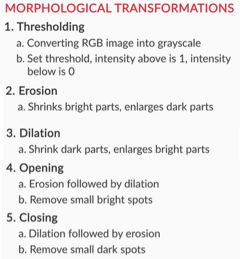

 Let's now look at some code to implement these morphological transformations. You will understand this best if you have your notebook open on the side. It's always helpful to run **small variations** of the code shown, and **see how the output changes**.

 ### Different Sizes of Structuring Element
 Morphological transformations are applied using the basic structuring element called 'disk'.  A disk is defined with the code:

 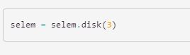

 As an exercise, try and run the code with a different value of the radius of the structuring element.

#### Coming Up
The pre-processing in this page was more to do with changing the shape, size and form of the image. In the next page, we'll work with pre-processing functions that have to do with **transforming the numerical data** in the image.

**Additional Reading**
1. You can also do all of these transformations with OpenCV. [Read how to do them here](https://docs.opencv.org/master/d9/d61/tutorial_py_morphological_ops.html).
2. "Natural Images" has a specific statistical definition as well. [Read this StackOverflow answer that describes this definition in some detail.](https://stats.stackexchange.com/questions/25737/definition-of-natural-images-in-the-context-of-machine-learning)

### Data Preprocessing: Normalisation

#### Normalisation of Images
Next, we move on to **normalisation**. You might remember normalisation from the previous sessions. It is a common technique used with all types of data.

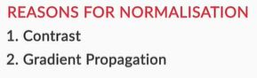

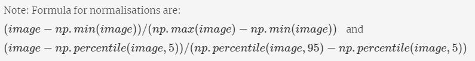

### Why do we Normalise?
Normalisation makes the training process much **smoother**. This is an important preprocessing step, so let's discuss it briefly.

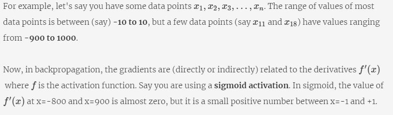

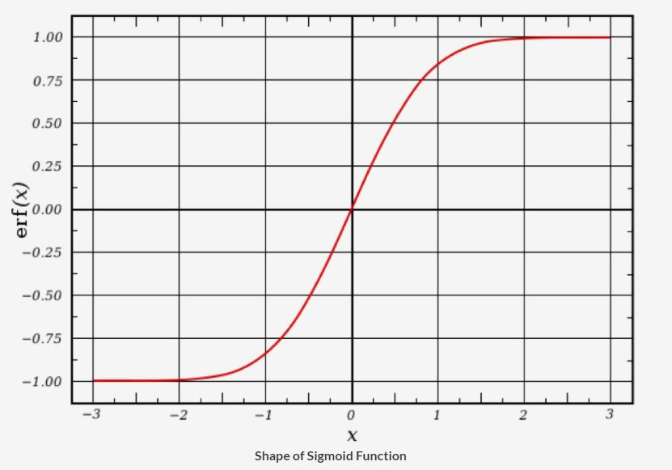

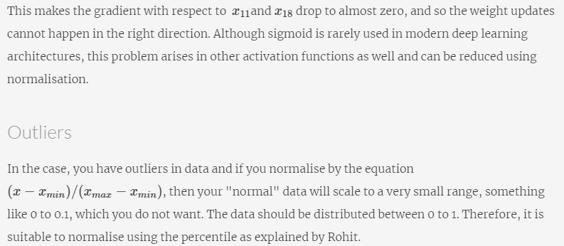

We have now transformed the original data to make it more suitable as input for training later. 

#### Coming Up
In the upcoming page, we will explore another important function of data pre-processing - creating extra data out of existing data. This falls under the umbrella term of **data augmentation**.

**Additional Reading**
1. Working with Neural Networks always involves using tricks to speed up computation. [This excellent paper uses a technique called 'pixel normalisation' to modify text data into an image form](https://arxiv.org/abs/1705.01809), in order to enable fast processing.

### Data Preprocessing: Augmentation

#### Insufficient Data
This brings us to the next aspect of data pre-processing - data augmentation. Many times, the **quantity of data that we have is not sufficient** to perform the task of classification well enough. In such cases, we perform **data augmentation**.

As an example, if we are working with a dataset of classifying gemstones into their different types, we may not have enough number of images (since high-quality images are difficult to obtain). In this case, we can perform augmentation to increase the size of your dataset.   

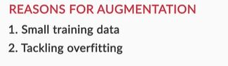

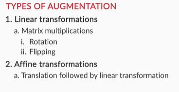

As you know that **pooling** increases the **invariance**. If a picture of a dog is in the top left corner of an image, with pooling, you would be able to recognize if the dog is in little bit left/right/up/down around the top left corner. But with training data consisting of data augmentation like **flipping, rotation, cropping, translation, illumination, scaling, adding noise** etc., the model learns all these variations. This significantly boosts the accuracy of the model. So, even if the dog is there at any corner of the image, the model will be able to recognize it with high accuracy. 

In this page, you learnt about augmentations. This should be used whenever our training data is small and we need to give the classifier more instances as training examples. There are mainly two types of augmentations:
1. Linear Transformations
2. Affine Transformations'

#### Practice Questions
Attempt the following questions. The solutions to these are available on the next page. We strongly urge you to try out these problems before viewing the solutions:
1. Write code to perform a left-right flip, followed by an up-down flip to the same image.
2. Normalise the image using 25th and 75th percentiles.
3. Perform a 90-degree rotation, and follow it up with a 4x zoom-in.

### Data Preprocessing: Practice Exercise Solutions
Following are the solutions to the practice problems mentioned in the last session:

1. Write code to perform a left-right flip, followed by an up-down flip to the same image.

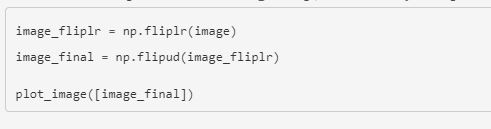

2. Normalise the image between the 25th and 75th percentiles.

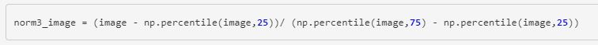

3. Perform a 90-degree rotation, and follow it up with a 4x zoom-in.

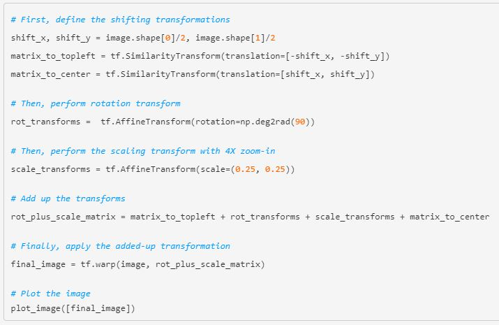

### ResNet: Original Architecture and Improvements
In the next few segments, you will build the network using the **ResNet architecture**. On this page, we will recap the architecture of ResNets and discuss some improvements proposed in it later. This is a content is intended to give you a high-level overview of the architecture - you can skip this if you want to learn the Python implementation directly.

#### ResNets - Original Architecture and Proposed Improvements
Since ResNets have become quite prevalent in the industry, it is worth spending some time to understand the important elements of their architecture.

Let's start with the original architecture [proposed here](https://arxiv.org/pdf/1512.03385.pdf). The basic problem ResNet had solved was that training very deep networks was computationally hard - e.g. a 56-layer net had a lower training accuracy than a 20-layer net. By the way, before ResNets anything having more than 20 layers was called very deep.

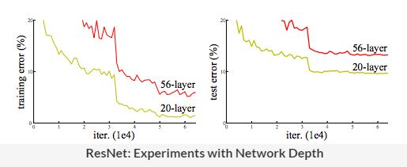

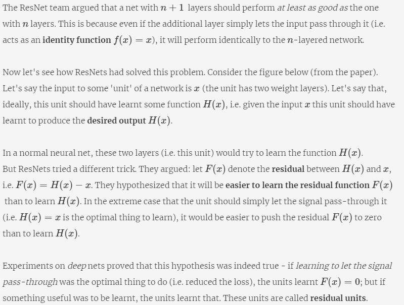

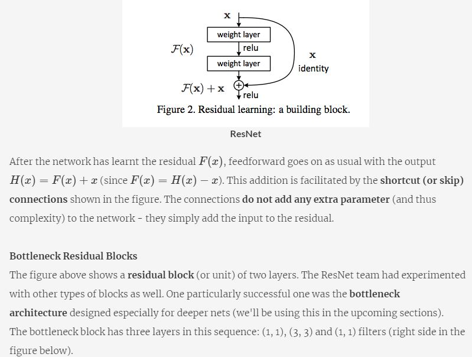

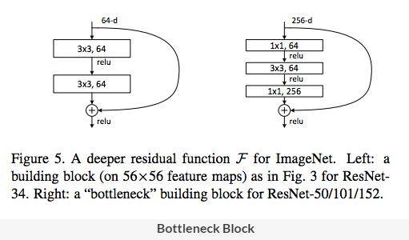

The reason why the bottleneck architecture works better than the vanilla one is beyond the scope of this discussion - you can [read the intuition here](https://stats.stackexchange.com/questions/347280/regarding-the-understanding-of-bottleneck-unit-of-resnet) and the details in the original paper. For practical purposes, it will suffice to remember that they **facilitate training** of deeper nets.

### Improved ResNet Architecture
In 2016, the ResNet team had proposed some improvements in the original architecture [here](https://arxiv.org/pdf/1603.05027.pdf). Using these modifications, they had trained nets of **more than 1000 layers** (e.g. [ResNet-1001](https://github.com/KaimingHe/resnet-1k-layers)) which had shown improved performance on the CIFAR-10 and 100 datasets. The basic ideas of the proposed design are explained below.

You know that skip connections act as a 'direct path' of information propagation within a residual block. The new architecture basically stretched the idea of skip connections from residual blocks to the entire network, i.e. if multiple units should ideally learn identity functions, the signal could be directly propagated across units.

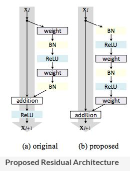

Another unconventional change proposed here was to use the activation function (ReLU) both before and after the weight layer (called pre and post-activation). On the right side of the figure above, the grey arrows show the 'direct path' whereas the other layers (BN, ReLU etc.) are on the usual path. This modification had boosted training efficiency (i.e. gradient propagation) and was thus used to train nets deeper than 1000 layers.

You can read more about the original and the proposed architectures in the papers (provided below). In the next few segments, you will use some variants of ResNet (ResNet-18, ResNet-34 etc.).

**Additional Reading**
1. [The ResNet paper, He et al](https://arxiv.org/abs/1512.03385).
2. [Proposed ResNet architecture, He et al](https://arxiv.org/pdf/1603.05027.pdf).

### Building the Network
Let's now build and train the model. As mentioned on the previous page, we will use some ResNet variants in the upcoming sections. We will now walk you through the 'ResNet builder' module which is basically a Python module containing all the building blocks of ResNet. We will use this module to import the variants of ResNets (ResNet-18, ResNet-34 etc.). 

Note that we are not using the ResNet implementation of Keras since it does not provide the flexibility to choose from these variants. The resnet.py module is taken from [here](https://github.com/raghakot/keras-resnet) (note that you will almost never write these modules, you only need to learn to import and use them). We will still walk through the module to understand the architecture better.

Here is the ResNet script 

[Python Script: resnet.py](dataset/resnet.py)

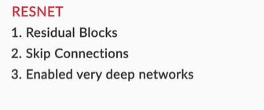

To summarise, the resnet.py module contains all the building blocks of ResNets using which we can build all the variants such as ResNet-18, ResNet-34, ResNet-50 etc. In the next few sections, we will use ResNet-18.

Next, let's move on to **data generators**. Please refer to the notebook for comments and explanations of the code.

**NOTE:**

Data generator supports preprocessing - it normalizes the images (dividing by 255) and crops the center (100 x 100) portion of the image. 
There was no specific reason to include 100 as the dimension but it has been chosen so that we can process all the images which are of greater than 100*100 dimension. If any dimension (height or width) of an image is less than 100 pixels, then that image is deleted automatically.
You can change it to 150 or 200 according to your need.

**Coming Up**
Before we train the full model, it is common to take a small chunk of the data and check whether your model is working on it. This is called an **ablation experiment**. We shall cover this in the next page.

### Ablation Experiments
Let's recap the steps we've taken up to now:
1. Pre-processed the data:
    1. Normalisation
    2. Augmentation
2. Built a network:
    1. Decide on an architecture (resnet-18)
    2. Run a data generator

Now, it's time to train the model. The first step of model-training is to conduct an **ablation experiment**. It is done to check whether your code is working as expected. Let's understand the basic idea of these experiments.

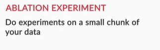

Ablation run refers to a process where you take a small subset of your data, and try to build your model on it. Broadly, an ablation study is where you systematically remove parts of the input to see which parts of the input are relevant to the networks output.

### Overfitting on Training Data
The next step is trying to overfit the model on the training data. Why would we want to intentionally overfit on our data? Simply put, this will tell us that whether the network is **capable of learning** the patterns in the training set.

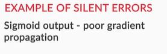

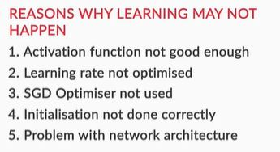

To summarise, a good test of any model is to check whether it can **overfit on the training data** (i.e. the training loss consistently reduces along epochs). This technique is especially useful in deep learning because most deep learning models are trained on large datasets, and if they are unable to overfit a small version, then they are unlikely to learn from the larger version.

During training, sometimes you may get **NaN** as a loss instead of some finite number. This denotes that the output value predicted by the model is very high, which results in high loss value. This causes exploding gradient problem. The problem could be a high learning rate and to overcome, you can use SGD Optimiser. Although the adaptive methods (Adam, RMSProp etc.) have better training performance, they can generalize worse than SGD. Furthermore, if you can also play with some of the initialisation techniques like Xavier initialisation, He initialisation etc. and change the architecture of the network if the problem does not get solved. 

Additional Reading
1. [This article](https://hackernoon.com/memorizing-is-not-learning-6-tricks-to-prevent-overfitting-in-machine-learning-820b091dc42) lists some common ways in which you can prevent your ML model from overfitting.
2. [This paper](https://arxiv.org/pdf/1705.08292.pdf) compares various optimisers. You can look at their graphs to know their findings. 

### Hyperparameter Tuning
On the previous segment, we trained the model on a small chunk of the dataset and confirmed that the model can learn from the dataset (indicated by overfitting). After fixing the model and data augmentation, we now need to find the learning rate for the optimiser (here SGD). Let's now **tune some hyperparameters** of the model.

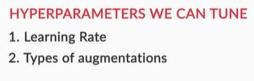
 
Here, we tuned the learning rate hyperparameter and observed that a rate of 0.1 is the optimal learning rate when compared to 0.01 and 0.001. However, you know that using such a high learning rate for the entire training process is not a good idea since the loss may start to oscillate around the minima later. So, at the start of the training, we use a high learning rate for the model to learn fast, but as we train further and proceed towards the minima, we decrease the learning rate gradually. 

### Keras Callbacks
Also, we have used **callbacks** to store the loss history at the end of every epoch. Using callbacks is an important technique to save results etc. of the model during specific points in training (such as the end of an epoch, start of a batch, etc.).

Next, let's see how to implement learning rate decay. Since we want to decay the learning rate at the end of every epoch, using callbacks is a natural decision. 

Here, the learning rate is set to decrease after every epoch as the dataset is small.  Typical values can be reducing the learning rate by a factor of 0.5 after every 5-10 epochs or by a factor of 0.1 every 20 epochs. Note that these numbers can differ significantly depending on the model and problem. Models often benefit from reducing the learning rate by a [factor of 2-10](https://keras.io/api/callbacks/#reducelronplateau) once learning stagnates (validation loss). 

You also learnt that a sample of original image data is picked from the directory and an equal number of augmented data is generated by **ImageDataGenerator** (using keras method) by applying random transformations to original images. The original and the augmented images are combined to form 2x data and used for training. We also pointed that it is better to use AUC curve rather than accuracy metrics, and especially if the dataset is skewed like in the case of the medical dataset where you have fewer samples of patients who have actually the disease. 

### Training and Evaluating the Model
In the previous segment, we discussed how to implement learning rate decay using callbacks. We also generated augmented images and combined with the original images to be used for training. 

Let us now discuss the choice of model evaluation metrics using examples from the medical domain. 

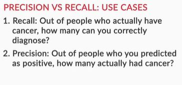

You saw specific use cases of precision and recall. These two measures depend heavily on the use case - even in the field of medicine, both of these can be effectively used.

This brings us to the close of the end-to-end session exploring the flowers dataset. We have built a model with a good AUC at the end of 3 epochs. If you train this using more epochs, you should be able to reach a better AUC value.

# Industry Demo: Using CNNs with X-ray Images

## Introduction
In the previous session, you learnt how to set up a pipeline for building and training CNNs. In this session, you will apply your skills to detect anomalies in **chest X-Ray scans**. 

### Recap of Techniques Learnt
You performed the following steps in the previous session:
1. **Data Preparation:**
    1. Made sure all our images were of the same resolution.
    2. Placed the images in two different folders - 'rose' and 'daisy'. This method will work for any application where you're trying to train using images.
2. **Data Pre-processing: Morphological Operations**
    1. Did thresholding on the image - converted it from a grey image to a binary image.
    2. Looked at Erosion, Dilation, Opening, Closing.
3. **Data Pre-processing: Normalisation**
    1. Understood the need for normalisation.
    2. Saw some commonly used methods of normalisation.
4. **Data Pre-Processing: Augmentation**
    1. Understood the need for data augmentation.
    2. Learnt about two types of transformations for augmentation - linear and affine.
    3. Saw different ways to augment - translation, rotation, scaling, etc.
5. **Model Building**
    1. Running ablation experiments
    2. Overfitting on a smaller version of the training set
    3. Hyperparameter tuning
    4. Mode training and evaluation

### Application to Chest X-rays
In this session, you will use these above methodologies from the previous session onto Chest X-ray data images.

### Examining X-ray images
In this session, we will apply what we had done in the first session to spot anomalies in Chest X-ray images. Which anomaly are we trying to spot? How do these anomalies look like? Let’s find the answers to these questions in an introduction of Chest X-ray images.

You can download the notebook used in this session below. You can also download the CXR data directly on your Nimblebox using the instructions provided at the bottom of this page.

[Jupyter Notebook: Working with Chest XRay Images](dataset/Working_With_Chest_XRay_Images.ipynb)

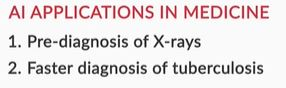

You saw that deep learning can be effectively used for spotting anomalies in X-rays to detect various diseases. You also saw that the application of deep learning to medical images has become easier due to the availability of open-source images. In this session, we will use X-Ray images from [this CXR dataset](https://www.kaggle.com/nih-chest-xrays) (though we will be using only two of these classes - the download instructions for the subsetted dataset are provided at the bottom of this page).

Let's go ahead and look at the data.

#### Getting CXR data on Nimblebox
For the purpose of this demonstration, we'll be working with two classes - 'effusion' and 'nofinding'. [We have collected these images in this zip file link](dataset/CXR_data_Two_classes.zip.001). 

**Notebook with dataset** is present in the Nimblebox in the machine "CNN Assignment -2".  Dataset is present in two folders: 'effusion' and 'nofinding' on your storage. 

### CXR Data Preprocessing - Augmentation
As we did for the Flowers dataset, let's now conduct the preprocessing steps with the CXR dataset. Due to the nature of the CXR images, some of these steps will be a little different.

For the flowers dataset, we did all the augmentations we possibly could. However, for the CXR data, we had some specific constraints.
1. Vertical flip needs to be set as 'False'. This is because CXR images have a natural orientation - up to down. 
2. We cannot (i.e. should not) do a centre crop for CXR images, as the anomaly can be in an area outside the cropped portion of the image.

### CXR Data Preprocessing - Normalisation
The next step in our preprocessing is **normalisation**. In this case, we will have to slightly modify the normalisation technique (rather than just dividing by 255). Let's see why.

What did we do differently here as compared to the flowers dataset?
1. Since the CXR images are not "natural images", we do not use the "divide by 255" strategy. Instead, we take the max-min approach to normalisation. Since you do not know for sure that the range of each pixel is 0-255, you normalise using the min-max values.
2. In the conditional statement 'if mode == train', use a random number generator so that only a fraction of the images get transformed (rather than all of them). 

### CXR: Network Building
Now that our data is ready and prepared, let's get into building the model.

The data class is highly imbalanced. The ratio of 'effusion' vs 'nofinding' is almost 10 (107/1000). As most of the data belongs to only one class, simply training in this scenario will not work as the model will learn mostly learn and classify most of the data as 'nofinding' resulting in high accuracy.  If you notice, around 90 per cent (1000/1107) of the data is 'nofinding' and if it classifies all the data as same, the accuracy will be 90 per cent which is close to 87 per cent accuracy which we have got. So, the objective to correctly classify the 'effusion'  is not fulfilled. The high accuracy clearly misleads us and therefore we will use AUC to validate the result. 

To recall, the basic steps to build the model will remain the same as you have seen in the previous session :
1. Import the resnet code (same one we used in the last session)
2. Run the augmented data generator
3. Perform an ablation Run
4. Fit the model

Finally, let's use validation AUC instead of accuracy as evaluation metrics and train the model keeping everything same such as network layers, data augmentation, pre-processing etc. 

Let's quickly recap the important concepts.
1. The model is not performing very well on AUC, the measure we had chosen. 
2. The main reason for this is the prevalence problem. There are just not as many abnormal cases available in the dataset. This problem will occur in almost all medical imaging problems (and for that matter, in most datasets that have a class imbalance)
3. To tackle this problem, we introduced 'weighted categorical cross-entropy'. This is a measure of loss, which applies weights to different forms of errors.

### Weighted Cross-Entropy
A common solution to the low prevalence rate problem is using a **weighted cross-entropy loss**. The loss is modified such that misclassifications of the low-prevalence class are penalised more heavily than the other class.

Therefore, every time the model makes an error on the abnormal class (in this case, ‘effusion’), we penalise it heavily by multiplying the loss by a high value of weights. This results in an increase in loss for misclassified classes and therefore the change in weights due to backpropagation is more. So, the learning curve for the weights responsible for misclassification is more. 

Let’s say “no finding” is class 0 and “effusion” is class 1.

**bin_weights[0,0]:**  Actual class: 0, Predicted class: 0, so no penalty, just normal **weight of 1**. 
**bin_weights[1,1]:**  Actual class: 1, Predicted class: 1, so no penalty, just normal **weight of 1**. 

In case of abnormality: 
**bin_weights[1,0]** - Actual class is 1, Predicted class is 0, penalise by weight of 5.
**bin_weights[0,1]** - Actual class is 0, Predicted class is 1, penalise by weight of 5.

**Additional Reading**
1. We turned to weighted cross-entropy when our neural network was not performing well. [Here's an article that lists down several reasons why your Neural Network may not be performing well](https://blog.slavv.com/37-reasons-why-your-neural-network-is-not-working-4020854bd607).

### CXR: Final Run
In the last page, we identified a problem with our model. We identified a root cause for this problem and proposed a specific solution - **weighted categorical cross-entropy**.

We save the model weights only when there is an increase in 'validation accuracy'. The method to save the model weights is called **checkpointing** and it is called using **keras callback**. The results clearly demonstrate that the AUC has significantly increased from 0.19 (without weights) to 0.78 (with weights).  Let's summarize what we have learnt in this session. 

In the next few epochs, the AUC get increased further to 0.85 from 0.78 (you can run the notebook to see the results).  If we want to make a prediction on an unseen sample, the standard procedure is to first create the model architecture and initialise it with the trained weights.  Then predict using the model. This brings us to the end of the session. We would just like to recap the skills and understanding you would have gained through this:

1. How a typical end-to-end pipeline in the industry looks like. 
2. How to preprocess image data when we are trying to train a CNN.
3. How to choose a network architecture
4. How to perform ablation runs
5. How to spot that the training is not working, and then further how to correct this flaw.

